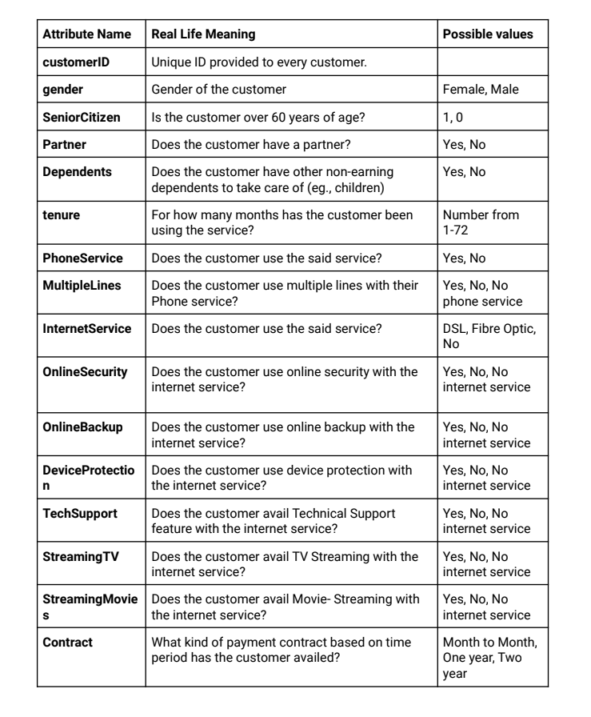
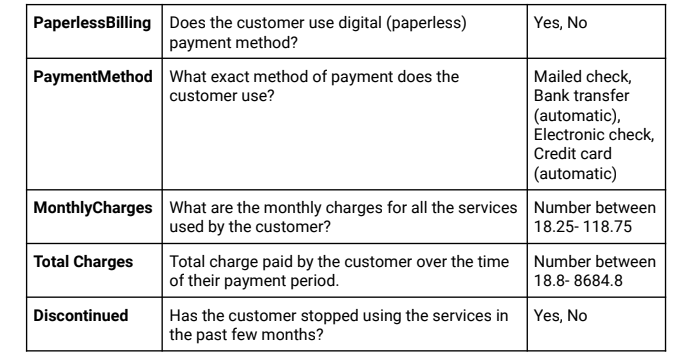

# Prediction-customer-continuity-service

INTRODUCTION:
The associated dataset gives information about the customers that have been using the services
of the telecom company. Some of these customers have left the service in the past months. You
have to analyze this data to create an algorithm that can predict if a said customer is likely to
discontinue the service in the next few months. This will help the telecom company develop
focused retention programs to make sure this customer keeps using their services.
Each row represents a customer; each column contains the customer’s attribute described on the
column. Therefore, to accurately judge the usefulness of each parameter, it is important to
understand what each attribute means in real-life terms. This will help you recognize hidden
patterns and dependencies in the data.
Salient Features:
● Each customer gets their own unique (and random) customer ID.
● Demographical characteristics such as Gender, Senior Citizenship, and presence of partner
or dependents are provided
● The telecom company provides two basic services: Phone Service and Internet service.
Certain other bundled services can also be availed by the customer if they use each of
these services. The phone service allows you to get a multiple-line collection. Availing the
internet service makes you eligible for many other services like:
○ Online Security
○ Online Backup
○ Device Protection
○ Technical Support
○ Streaming TV
○ Streaming Movies
Keep in mind that the customer can avail these additional services only if they already use
the basic Phone Service or the Internet Serivce.
● Details of the payment duration, method, and amount for customers have been provided.
● Finally, the important (output) feature has been provided- whether or not the customer
discontinued (stopped using) the service in the past few months. Your model must be able
to carry out classification with this variable as the output.
Note: Most of the data values are string values that represent real-life terms. Therefore, you
must encode these as numbers before you train your model.

